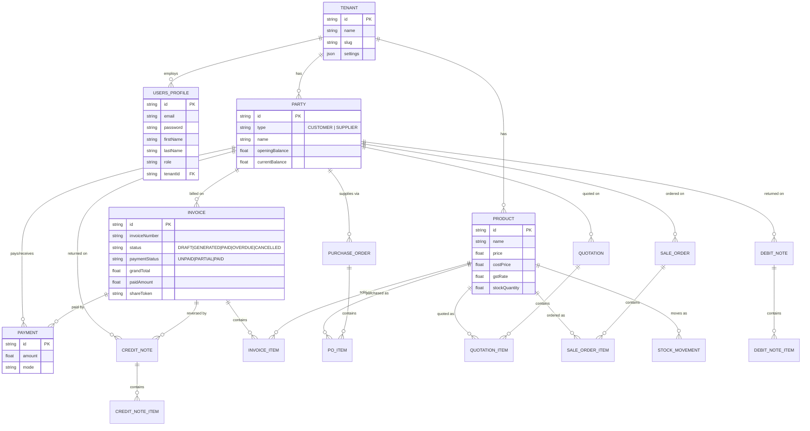

# Database

PostgreSQL, managed through Prisma (`prisma/schema.prisma`). The project
uses `prisma db push` (schema sync) rather than the `prisma migrate`
workflow — there is no `prisma/migrations` history, so schema changes are
applied directly. Every table has a `tenantId` column for multi-tenant
isolation (enforced in application code, not at the database level).

## Entity-relationship diagram

Core entities and how they relate (simplified — every domain table also
has a `tenantId -> Tenant` relation not drawn here for clarity):



## Notable design points

- **`Invoice.shareToken`** (`@default(uuid())`) is the public, unguessable
  token used by the customer-facing share link at `/invoice/[token]`
  (`actions/public/invoice.ts`). It is intentionally separate from the
  invoice's primary key so links can't be enumerated by ID.
- **Enums are uppercase** (`InvoiceStatus.GENERATED`, `PartyType.CUSTOMER`,
  `PaymentMode.BANK_TRANSFER`, etc.). Every form/schema in the app must map
  its (often lowercase) values to the matching uppercase enum before
  writing to Prisma — this mismatch was the single most common class of
  bug found during the audit that produced this documentation set.
- **`Payment` has no direction field.** Whether a payment increases or
  decreases a party's balance is inferred from `Party.type` in
  `PartyService.recalculatePartyBalance()` — CUSTOMER payments reduce
  receivable, SUPPLIER payments reduce payable. There is currently no
  "payment out" recording path in the UI, so in practice every `Payment`
  row today is a customer payment-in.
- **Indexes**: every tenant-scoped table has `@@index([tenantId])`. Some
  models additionally have a `@@unique([tenantId, <number>])` constraint
  (e.g. `Invoice` on `[tenantId, invoiceNumber]`, `SaleOrder` on
  `[tenantId, orderNumber]`) to prevent duplicate document numbers within
  a tenant.
- **Cascade behavior**: deleting a `Tenant` cascades and removes all of
  its data (`onDelete: Cascade` on every tenant relation) — this is what
  the QA seed script (`prisma/seed-qa-data.ts`) relies on for cleanup.

## Working with the schema

```bash
# Edit prisma/schema.prisma, then:
npx prisma db push        # sync schema to the database
npx prisma generate       # regenerate the Prisma Client types
npx prisma studio         # browse data in a GUI
```

There is no migration history to keep in sync — `db push` is destructive
only if you remove/rename a column with existing data (it will warn and
require `--accept-data-loss`). Prefer additive changes (new nullable or
`@default`-ed columns) when possible, exactly as this audit did for
`PoItem`, `Party`, and `UsersProfile`.
